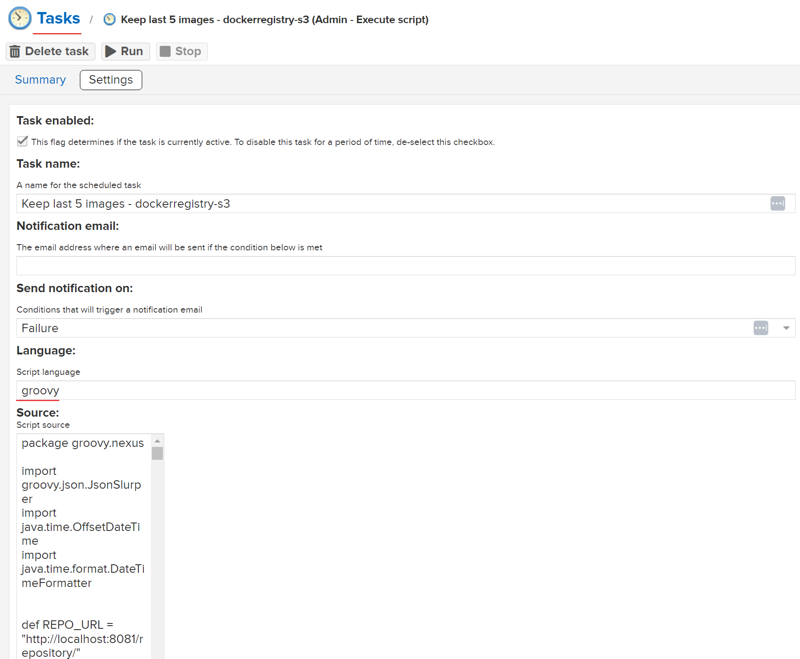

# nexus-docker-cleaner
This repository contains a script useful to clean docker images on nexus registry.

## Description
The script is made to be run as a "nexus Task", it is executed by nexus application.<br>
You can even run the script outside nexus environment by changing the repository url.<br>
Note:
The script generate a log file in /opt/sonatype-work/nexus3/log/nexus_clear.log<br>
The log file keep only the last execution logs.<br><br>
Change these variables as you need:
| Var | Value |
| ---     | ---   |
| REPO_URL | Change it only if you run it outside nexus env |
| USER | Nexus user |
| PASSWORD | Nexus password |
| BUCKET | Nexus docker registry |
| KEEP_SNAPSHOT_IMAGES | Number of images tagged as SNAPSHOT to keep  |
| KEEP_VERSION_IMAGES | Number of non SNAPSHOT images to keep |
<br>

To add the script, go on Settings --> Tasks --> Create new task<br>
and select "Admin - Execute script"
Then paste the script content in "Source"


## Install & Dependence
- groovy

## Use
  ```
  groovy App.groovy
  ```
